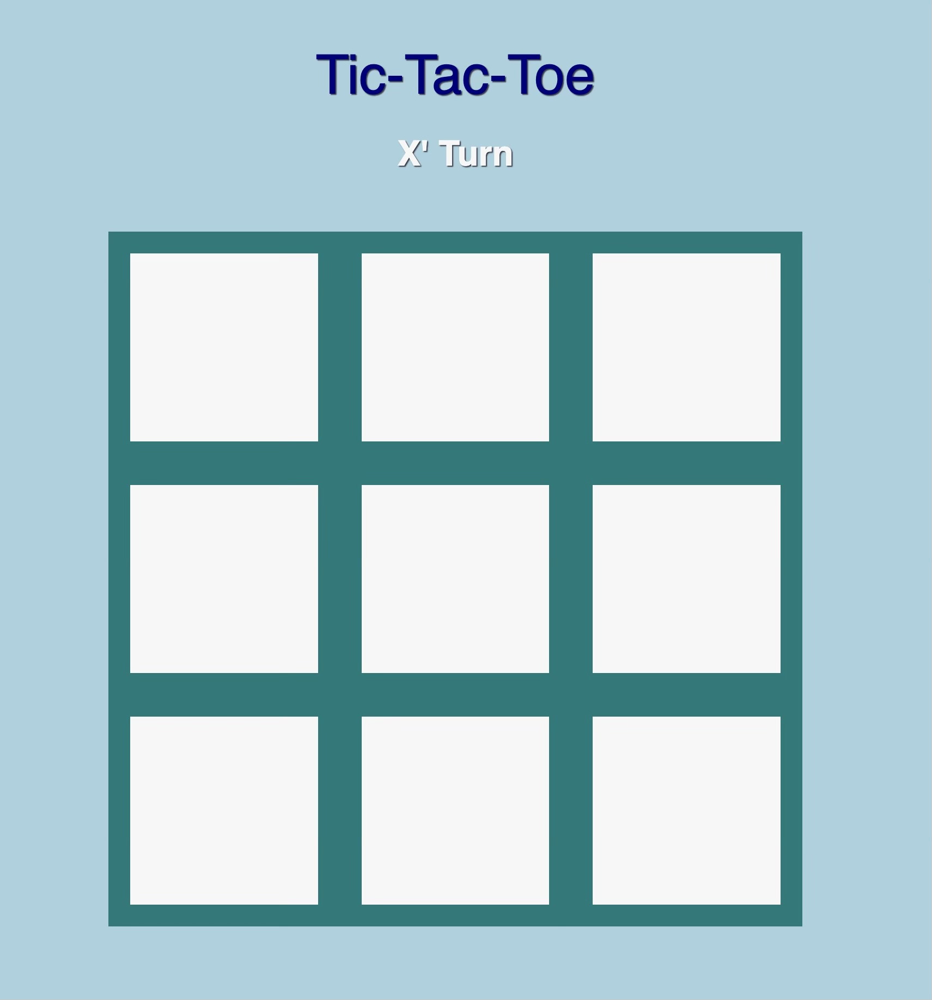

# TIC Tac Toe

## Languages Used:
HTML CSS Javasciprt

## About The Game:
Experience the classic game of tic-tac-toe with a twist! Enjoy the immersive sound effects that accompany each move: a satisfying smack for "X," a gentle whoosh for "O," and a cheerful cheer for every win or tie. This interactive game was crafted using a blend of HTML, CSS, and JavaScript, adding a delightful audio dimension to your gaming experience.

## Getting Started!

### Upon opening the page:
The website will open to the tic-tac-toe game where the users will be prompted who's turn it is.
Players will be able to start playing the game immediately after opening to this page.

### When X's or O's are placed:
When an X is placed, players will hear a a satifying "smack" sound affect to their placement.
The same soun affect play will occur when a player places an "O" except this time it is a whoosh.

### When the game has been won:
Players can win the game by matching 3 in a row whether it be horizontal, vertical, or diagnol.
Upon winning the game, players will hear a cheer for their success and a "You Win" displayed where the player turn once was. Additionally, the play again button will appear. The same will apply for Ties except isntead of a "You Win!" being displayed it will say "Tie!". 

### When play again has been selected:
Players will return back to the opening page where the player turn is prompted and the game may begin once again! The cycle will continue for as long as they wish to play.

## For future advancements:
1. Sound Effects: Add a distinct sound effect for a tie outcome. 
   
2. Background Music: Integrate upbeat and engaging music similar 
   to Kahoot for a more immersive experience.                    
   
3. Enhanced Styling: Utilize CSS to improve the visual appeal of
   the game, and explore frameworks like Bootstrap or Tailwind
   CSS to add more dynamic and responsive elements.              
   
4. These enhancements can elevate the overall experience of your
   tic-tac-toe game, making it more engaging and enjoyable for
   players.                                                      
